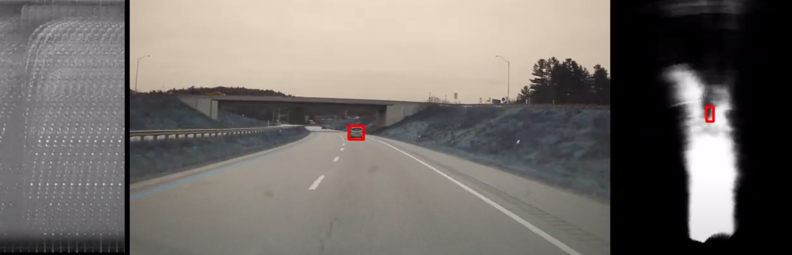

# Raw High-Definition Radar for Multi-Task Learning

## Paper


[Raw High-Definition Radar for Multi-Task Learning](https://arxiv.org/pdf/2112.10646)  
 [Julien Rebut](https://www.linkedin.com/in/julien-rebut-9803887b),  [Arthur Ouaknine](https://arthurouaknine.github.io/), [Waqas Malik](https://www.linkedin.com/in/waqas-malik-2070012b/), [Patrick Pérez](https://ptrckprz.github.io/)  
valeo.ai, France  

## Abstract
With their robustness to adverse weather conditions and ability to measure speeds, radar sensors have been part of the automotive landscape for more than two decades. Recent progress toward High Definition (HD) Imaging radar has driven the angular resolution below the degree, thus approaching laser scanning performance. However, the amount of data a HD radar delivers and the computational cost to estimate the angular positions remain a challenge. In this paper, we propose a novel HD radar sensing model, FFT-RadNet, that eliminates the overhead of computing the Range-Azimuth-Doppler 3D tensor, learning instead to recover angles from a Range-Doppler spectrum. FFT-RadNet is trained both to detect vehicles and to segment free driving space. On both tasks, it competes with the most recent radar-based models while requiring less compute and memory. Also, we collected and annotated 2-hour worth of raw data from synchronized automotive-grade sensors (camera, laser, HD radar) in various environments (city street, highway, countryside road). This unique dataset, nick-named RADIal for "Radar, Lidar et al.", is available at this https URL.

## Demo
[](https://www.youtube.com/watch?v=t9WNLUiWDFE "")


### Datasets
Download the RADIal dataset as explained [here](https://github.com/valeoai/RADIal)

### Pre-trained models
Pre-trained models can be downloaded [here](https://drive.google.com/drive/folders/1qh_ixfiDRUAiXg0d0SIBv0wj2L_DxTIS?usp=share_link)


### Training
For evaluation, execute:
```
$ python 1-Train.py --config config/config_FFTRadNet_192_56.json
```

### Testing
For testing, execute:
```
$ python 2-Test.py --config config/config_FFTRadNet_192_56.json --checkpoint FFTRadNet_RA_192_56_epoch78_loss_172.8239_AP_0.9813.pth
```

### Performance evaluation
To evaluate performances, run the following script:
```
$ python 3-Evaluation.py --config config/config_FFTRadNet_192_56.json --checkpoint FFTRadNet_RA_192_56_epoch78_loss_172.8239_AP_0.9813.pth
```

## License
FFTRadNet is released under the [Apache 2.0 license](./LICENSE).

