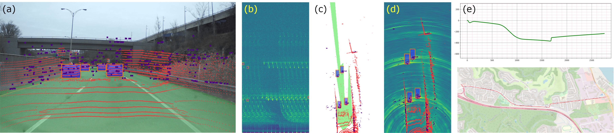
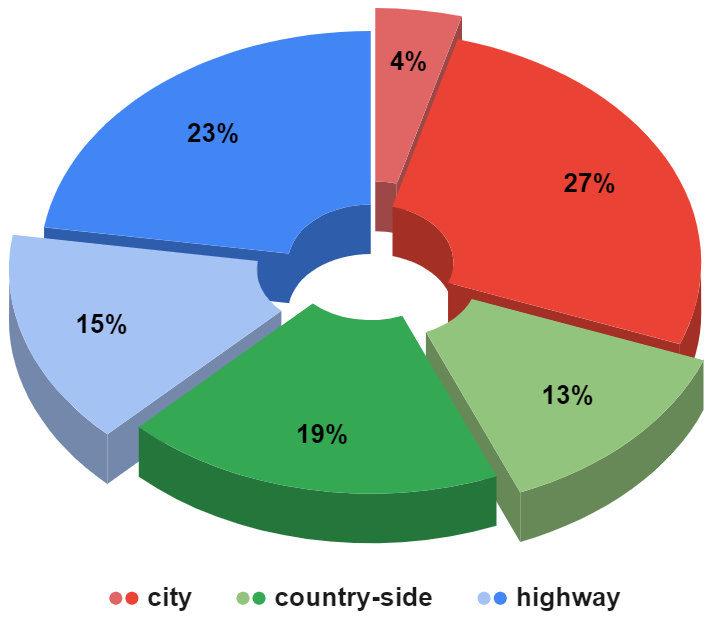
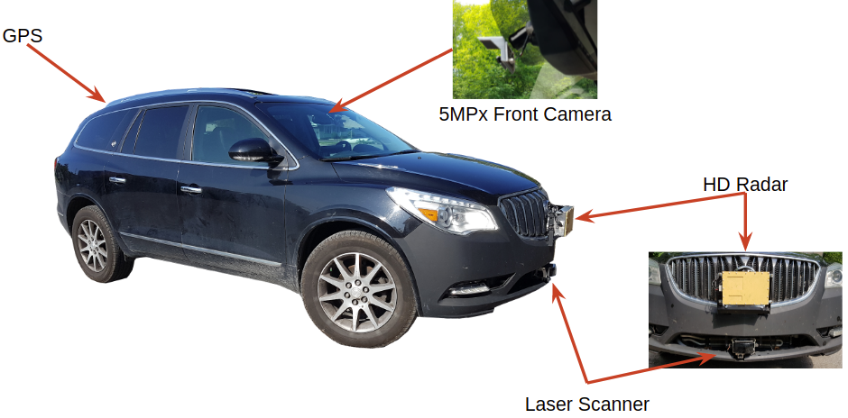
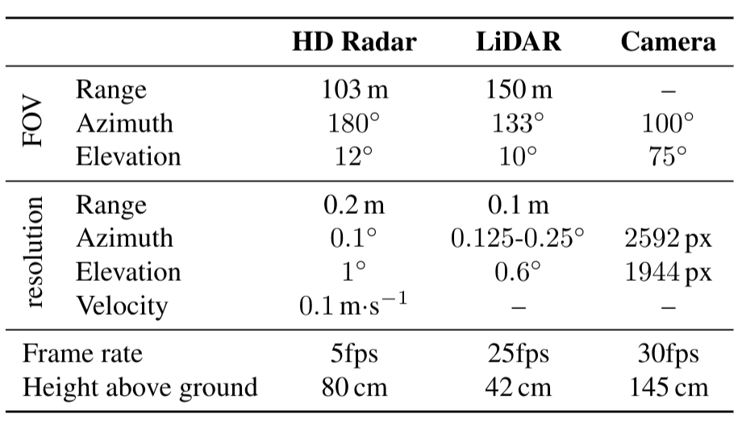

<p align="center">
  
</p>

# Latest news:
RADIal will be released on **2022, January 28th**. We are currently working on the data anonymization.
However, we provide now the dataset version used in 'citation du papier' saved as a zip file (see the download section). 

# RADIal dataset
RADIal stands for “Radar,  Lidar et  al.” It's a collection of 2-hour of raw  data  from  synchronized  automotive-grade  sensors (camera,  laser,  High Definition  radar)  in  various  environments  (citystreet,  highway,  countryside  road) and comes with GPS and vehicle’s CAN traces.

mettre un gif

RADIal contains 91 sequences of 1 to 4 minutes in duration, for a total of 2 hours. These sequences are categorized in highway, country-side and city driving. The distribution of the sequences is indicated in the figure below. Each  sequence  contains raw  sensor signals recorded  with their native frame rate. There are approximately 25,000 frames with the three sensors synchronized, out of which 8,252 are labelled with a total of 9,550 vehicles.<br/>

<p align="center">
  
</p>

# Sensor  specifications
<p align="center">
  
</p>

Central  to  the RADIal  dataset,   our  high-definition  radar  is  composed  of NRx=16 receiving antennas and NTx= 12 transmitting antennas, leading to NRx·NTx= 192 virtual antennas. This virtual-antenna array enables reaching a high azimuth angular resolution while estimating objects’ elevation angles as well. As the radar signal is difficult to interpret by annotators and practitioners alike, a 16-layer automotive-grade laser scanner (LiDAR) and a 5 Mpix RGB camera are also provided. The  camera  is  placed  below  the  interior  mirror behind the windshield while the radar and the LiDAR are installed in the middle of the front ventilation grid, one above the other. The three sensors have parallel horizontallines of sight, pointing in the driving direction. Their extrinsic parameters are provided together with the dataset.  RADIal also offers synchronized GPS and CAN traces which give access to the geo-referenced position of the vehicle as well as its driving information such as speed, steering wheelangle and yaw rate. The sensors’ specifications are detailed in the table below.<br/>

<p align="center">
  
</p>

# Dataset structure
RADIal is a unique folder containing all the recorded sequences. Each sequence is a folder containing:
* A preview video of the scene (low resolution);
* The camera data compressed in MJPEG format;
* The Laser Scanner point cloud data saved in a binary file;
* The ADC radar data saved in a binary file. There are 4 files in total, one file for each radar chip, each chip containing 4 Rx antennas;
* The GPS data saved in ASCII format
* The CAN traces of the vehicle saved in binary format
* And finally, a log file that provides the timestamp of each individual sensor event.

We provide in a separated repository a python library [DBReader](https://pages.github.com/) to read the data.
Because all the radar data are recorded in a RAW format, that is to say the signal after the Analog to Digital Conversion (ADC), we provided too an optimized python library [HDR_SignalProcessing](https://pages.github.com/) to process the Radar signal and generate either the Power Spectrums, the Point Cloud or the Range-Azimuth map.

# Labels
Out of the 25,000 synchronized frames, 8,252 frames are labelled.
Labels for vehicles are stored in a separated csv file. Each label containg the following information:
* numSample: number of the current synchronized sample between all the sensors. That is to say, this label can be projected in each individual sensor with a common dataset_index	value. Note that there might be more than one line with the same numSample, one line per label;
* [x1_pix, y1_pix, x2_pix, y2_pix]: 2D coordinates of the vehicle' bouding boxes in the camera coordinates;
* [laser_X_m, laser_Y_m, laser_Z_m]: 3D coordinates of the vehicle in the laser scanner coordinates system. Note that this 3D point is the middle of either the back or front visible face of the vehicle;
* [radar_X_m, radar_Y_m, radar_R_m, radar_A_deg, radar_D, radar_P_db]: 2D coordinates (bird' eyes view) of the vehicle in the radar coordinates system either in cartesian (X,Y) or polar (R,A) coordinates. radar_D is the Doppler value and radar_P_db is the power of the reflected signal;
* dataset: name of sequence it belongs to;
* dataset_index: frame index in the current sequence;
* Difficult: either 0 or 1

Note that -1 in all field means a frame without any label.

Labels for the Free-driving-space is provided as a segmentaion mask saved in a png file.

# Download instructions
```
$ wget https://www.dropbox.com/s/ubbwvdyskrkv7dn/RADIal_extract.zip?dl=0
```

# Citation

